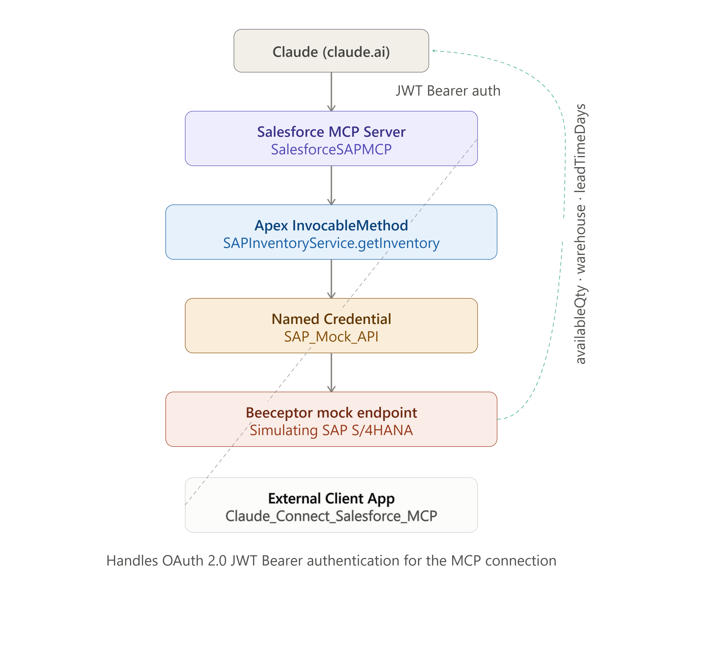
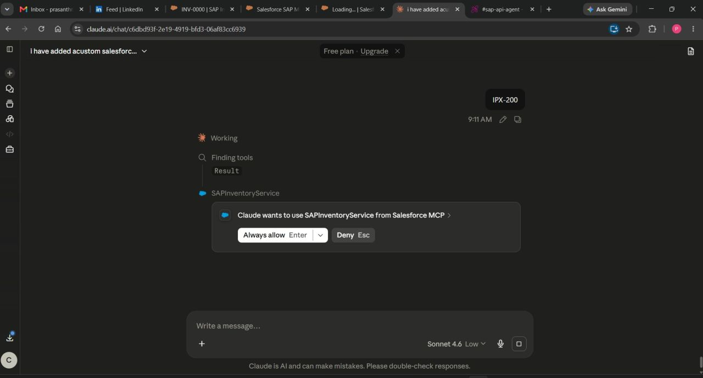
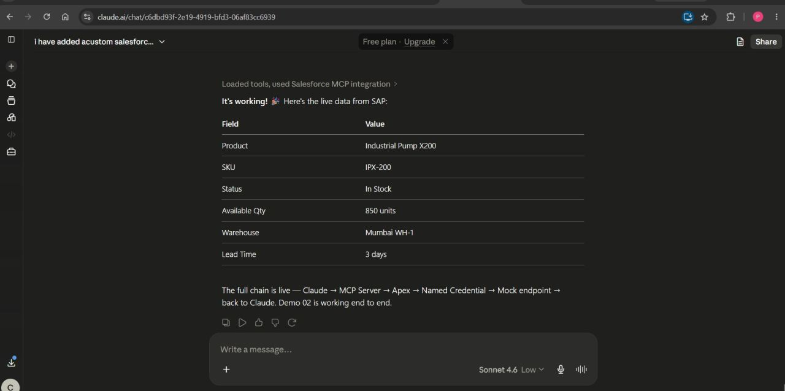

# Salesforce SAP MCP Integration

Claude connects directly to Salesforce via a custom MCP Server, 
invoking Apex to fetch live SAP inventory data. No middleware. 
No Flow. Direct agent-to-backend integration.

---

## Business Problem

AI agents need a secure, structured way to call enterprise backend 
systems — not screen scraping, not unstructured API calls. 
MCP (Model Context Protocol) solves this by exposing typed, 
governed tools that an LLM can call directly.

This project proves Claude can securely query live SAP inventory 
data through Salesforce, using Apex as the typed execution layer.

---

## Architecture



## How It Works

1. Claude calls the registered MCP tool `SAPInventoryService` with a SKU
2. Request authenticated via OAuth 2.0 JWT Bearer flow through the External Client App
3. Salesforce MCP Server routes the call to the Apex InvocableMethod
4. Apex makes an HTTP callout via Named Credential to the SAP endpoint
5. Response parsed and returned as typed output
6. Claude composes a natural language answer from the structured data

## Live Verified Response

| Field | Value |
|---|---|
| SKU | IPX-200 |
| Product | Industrial Pump X200 |
| Available Qty | 850 units |
| Status | In Stock |
| Warehouse | Mumbai WH-1 |
| Lead Time | 3 days |

## Components

| Component | Type | Purpose |
|---|---|---|
| SalesforceSAPMCP | MCP Server Definition | Exposes Apex as MCP tool |
| Claude_Connect_Salesforce_MCP | External Client App | OAuth/JWT auth for Claude |
| SAPInventoryService | Apex Class (Invocable) | Calls SAP, returns typed result |
| SAPInventoryServiceTest | Apex Test Class | Test coverage |
| SAP_Mock_API | Named Credential | Secure SAP endpoint URL |
| SAP_Mock_External | External Credential | Auth configuration |
| SAP_Agent_Access | Permission Set | Apex + object access |

## Security — JWT Bearer Flow

| Step | What Happens |
|---|---|
| 1 | Claude authenticates using a signed JWT, not username/password |
| 2 | Salesforce validates the JWT signature against the registered certificate |
| 3 | Salesforce issues a session token scoped to the MCP server's permitted tools |
| 4 | No long-lived credentials exposed — every session is token-based and short-lived |

Same auth pattern enterprises use for server-to-server integrations, applied here to agent-to-backend communication.

## Apex Implementation

```apex
@InvocableMethod(
    label='Get SAP Inventory'
    description='Fetches live inventory data from SAP for a given product SKU'
)
global static List<InventoryResult> getInventory(List<InventoryRequest> requests) {
    // Calls SAP_Mock_API named credential
    // Returns typed InventoryResult: productName, availableQty, 
    // warehouse, leadTimeDays, status
}
```

Typed request/response wrapper classes mean the MCP tool schema is strongly typed — Claude knows exactly what input is required and what shape the response takes.

## Problems Faced & How They Were Solved

| Problem | Root Cause | Fix |
|---|---|---|
| External Credential access error on Apex callout | MCP server's execution user lacked the External Credential principal mapping | Added principal mapping to SAP_Agent_Access permission set, assigned to integration user |
| MCP tool not appearing for Claude | Apex method not registered in McpServerDefinition metadata | Added tool registration block mapping SAPInventoryService as a callable tool |

## Prerequisites

| Requirement | Detail |
|---|---|
| Salesforce org | MCP Server support enabled |
| External Client App | JWT Bearer Flow configured |
| Salesforce CLI | `npm install -g @salesforce/cli` |

## Deployment

```bash
sf org login web
sf project deploy start --manifest package.xml
sf org assign permset --name SAP_Agent_Access
sf org assign permset --name SAP_Mock_API_Access
```

## Admin Configuration

| Step | Action |
|---|---|
| 1 | External Client App — enable "Issue JWT-based access tokens" under OAuth settings |
| 2 | Upload certificate — generate self-signed cert, upload public key to External Client App |
| 3 | Permission Set Mapping — map External Credential principal to integration user's permission set |
| 4 | MCP Server Definition — verify SAPInventoryService tool is listed and active |
| 5 | Connect from claude.ai — add Salesforce MCP connector using the org's My Domain URL, not api.salesforce.com |

## Demo




## Production Considerations

| Area | Current State | Production Fix |
|---|---|---|
| SAP endpoint | Mock via Beeceptor | Update Named Credential URL to real S/4HANA endpoint — no Apex changes needed |
| Error handling | Apex returns success:false with errorMessage on failure | Already production-ready — Claude surfaces errors gracefully |
| Rate limiting | Single SKU per call | Add governor limit checks for bulk SKU lookups |

## Key Insight

The agent is a trigger, not an executor. Claude extracts the SKU from natural language and calls a typed Apex method — validation rules, sharing rules, and business logic all still apply. MCP is the contract layer that makes this connection type-safe and secure.

## Tech Stack

| Layer | Technology |
|---|---|
| AI Connector | Claude (claude.ai MCP connector) |
| Auth | OAuth 2.0 JWT Bearer Flow |
| Backend Logic | Apex (@InvocableMethod) |
| Credential Management | Named Credentials + External Credentials |
| MCP Layer | Salesforce MCP Server Definition |